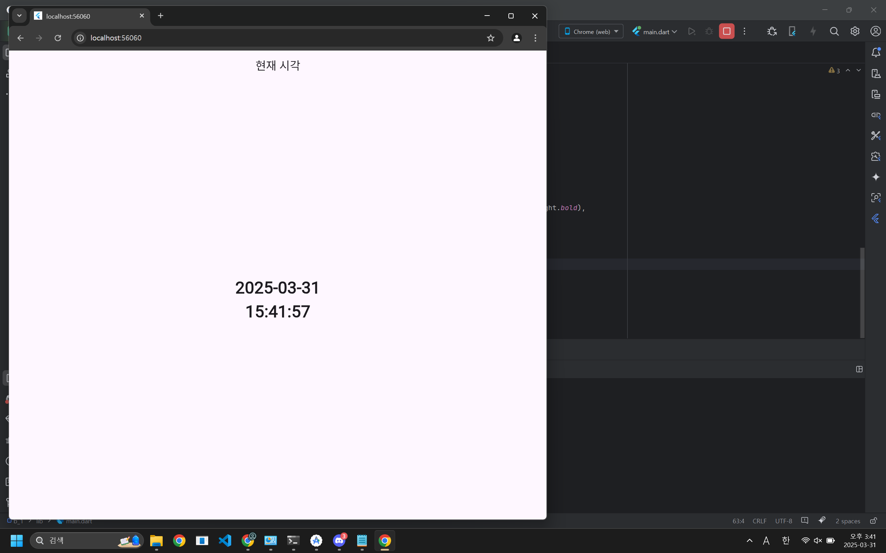

# 시간 구하기

```jsx
import 'dart:async';
import 'package:flutter/material.dart';

void main() {
  runApp(MyApp());
}

class MyApp extends StatelessWidget {
  @override
  Widget build(BuildContext context) {
    return MaterialApp(
      debugShowCheckedModeBanner: false,
      home: CurrentTimeScreen(),
    );
  }
}

class CurrentTimeScreen extends StatefulWidget {
  @override
  _CurrentTimeScreenState createState() => _CurrentTimeScreenState();
}

class _CurrentTimeScreenState extends State<CurrentTimeScreen> {
  String _currentTime = "";
  late Timer _timer;

  @override
  void initState() {
    super.initState();
    _updateTime();
    _timer = Timer.periodic(Duration(seconds: 1), (Timer t) => _updateTime());
  }

  void _updateTime() {
    setState(() {
      DateTime now = DateTime.now();
      _currentTime = "${now.year}-${now.month.toString().padLeft(2, '0')}-${now.day.toString().padLeft(2, '0')}\n"
          "${now.hour.toString().padLeft(2, '0')}:${now.minute.toString().padLeft(2, '0')}:${now.second.toString().padLeft(2, '0')}";
    });
  }

  @override
  void dispose() {
    _timer.cancel();
    super.dispose();
  }

  @override
  Widget build(BuildContext context) {
    return Scaffold(
      appBar: AppBar(
        title: Text("현재 시각"),
        centerTitle: true,
      ),
      body: Center(
        child: Text(
          _currentTime,
          style: TextStyle(fontSize: 32, fontWeight: FontWeight.bold),
          textAlign: TextAlign.center,
        ),
      ),
    );
  }
}
```



https://github.com/izuna69/app/blob/test2/2021136057_b/image.png
