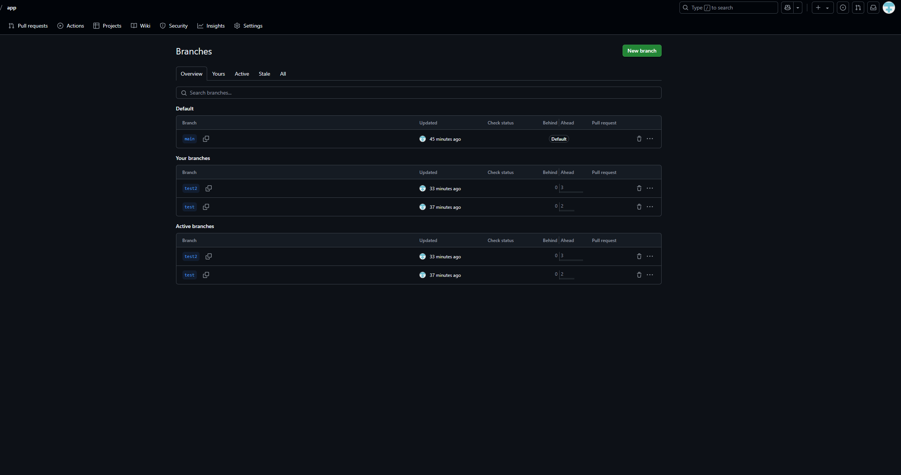
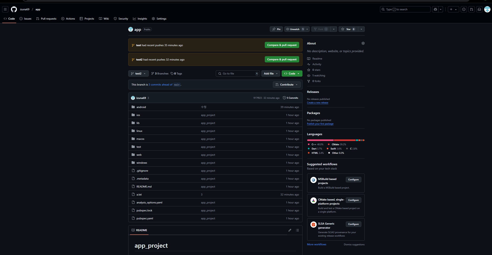

flu# 플루터로 hello world 앱실행하기

## 환경 구축과 문제점들

저는 android studio, git , flutter 깔았습니다

flutter  압축해제과정에서 반디집이  crc압축해제오류가 있어서 7zip으로 진행했습니다.

안드로이드 스튜디오에서 먼저 sdk를 설정하고 셋팅에 git을 연동했습니다

다음으로 git이 잘 깔렸는지 git init 을 터미널로 확인해주었습니다. 환경변수는 이미 설정되어있어 한번에 잘 작동했습니다.

flutter는 처음 환경변수 설정했음에도 불구하고 계속 오류가 떠서 c드라이브 바로 밑에 깔고 관리자 권한으로 실행하니 해결되었습니다.

## 플루터로 hello world 띄우기

제가 알던 안드로이드 스튜디오 환경이랑은 달라 오래걸렸습니다

```jsx
import 'package:flutter/material.dart';

void main() {
  runApp(const MyApp());
}

class MyApp extends StatelessWidget {
  const MyApp({super.key});

  @override
  Widget build(BuildContext context) {
    return MaterialApp(
      title: 'Flutter Demo',
      theme: ThemeData(
        colorScheme: ColorScheme.fromSeed(seedColor: Colors.deepPurple),
      ),
      home: const MyHomePage(),
    );
  }
}

class MyHomePage extends StatelessWidget {
  const MyHomePage({super.key});

  @override
  Widget build(BuildContext context
    return Scaffold(
      appBar: AppBar(
        title: const Text('my app'),
      ),
      body: const Center(
        child: Text(
          'Hello, World!',
          style: TextStyle(fontSize: 24, fontWeight: FontWeight.bold),
        ),
      ),
    );
  }
}

```

코드를 다지우고 구글링해서 헬로월드 코드부터 찾았습니다.

그리고 원래있던 코드랑 비교해서 구조를 먼저 파악했습니다. 그러다 문득 든 생각이 xml 파일이 따로 없고 위젯에 위젯을 잇네? 라고 이해했습니다. 아직 정확한 구조는 파악못했지만 파일이 main.dart에서 거의 해결되었습니다.


무사히 hello 를 띄우고 git에 올릴려 합니다.

## git 올리기

예전에 잠깐 git을 써서 많이 애먹진 않았습니다

터미널에서 관리자권한부터 줄려고 했는데 기능이 안보여서 깃 test라는 기능이 있길래 누르고 터미널 실행했더니 바로 되었습니다. 먼저 init을 해주고 생성해주었습니다.

다음으로 git add . 을 하여 모두 추가하고 커밋하여 저장해주었습니다.

푸쉬하기전 레파지스트리 만들어주고 브랜치이름은 main,test1,test2로 해주었습니다





푸쉬까지 다끝나고 추가된파일과 수정된 파일 확인해주었습니다.d